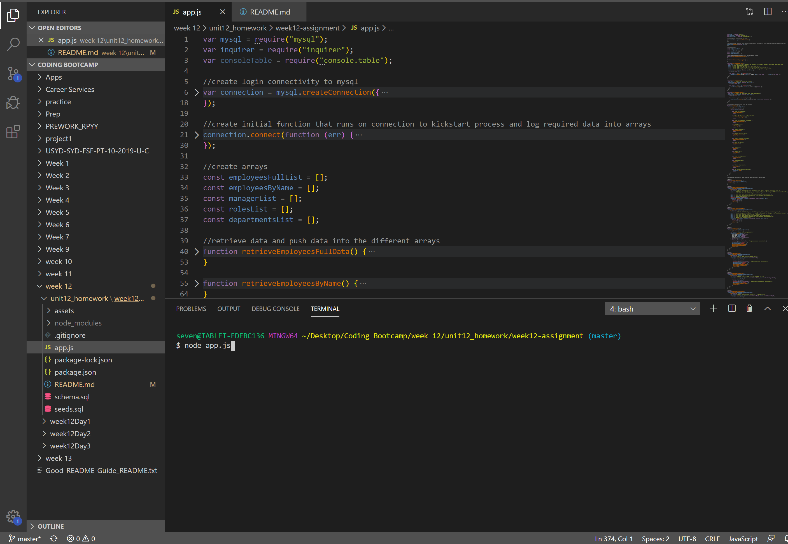

# week12-assignment - Employee Tracker

+ Github Repo link: https://github.com/sevenspell/week12-assignment

## Description 

This project is to create a CLI that allows users to interact with the mySQL database, which includes functionalities such as viewing data based on specified criteria, adding data, removing data, and updating data. 

This is performed by designing questions using the NPM Inquirer package, then retrieving data directly from mySQL and offering the data as choices for the users. The selected answers are then fed into the query to re-query / update the database again.

## Applications / Technology Used
+ Inquirer
+ MySQL
+ Node

## Usage 

1. Open the Gitbash terminal and type 'node app.js' and press 'enter'.

2. Select one of the choices offered. (In this screenshot example, 'View All Employees' was chosen.)

3. You can see a table of all employees' data.

4. Select any of the other choices offered and follow the instructions. (In this screenshot example, 'Add Employee' was chosen.)

5. Follow the instructions and you will see message informing you that action was successful.

6. You can 'View All Employees' again to verify your previous action was indeed successful. You can play around with other selections, but if you'd like to end the process, select 'No further action required'.

## Credits
I had some guidance from Wagner (https://wagner-lopes.github.io/).